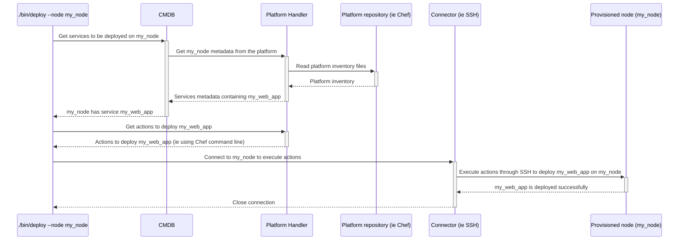

# **Hybrid Platforms Conductor**

**Making DevOps processes agile and robust in an environment integrating multiple technologies and platforms.**

# Table of Contents
  * [Overview](#overview)
  * [Installation](#installation)
  * [First time setup](#first_setup)
  * [How to use tools from Hybrid Platforms Conductor](#how_to)
  * [Concepts](#concepts)
  * [Tutorial](#tutorial)
  * [List of tools available](#tools_list)
  * [Credentials](#credentials)
  * [Environment variables](#environment)
  * [Metadata](#metadata)
  * [Development API](#development_api)
  * [Extending Hybrid Platforms Conductor with plugins](#extending)
  * [Development corner](#development_corner)

<a name="overview"></a>
# Overview

## Why?

DevOps practices involve a lot of processes definition, automation, testing and good practices in the whole **development and operations workflows**.
Having agile DevOps processes when dealing with homogeneous platforms (for example on only 1 cloud provider) or a fixed set of technologies (for example deploying using Ansible only) is easy.

However reality is not that simple for a lot of organizations:
* IT professionals may want to **not bind themselves to a single platform's technology or cloud provider**.
* DevOps teams may not want their processes and their agility to be too much coupled to a platform, cloud provider or a technology. Being able to adopt multiple platforms ensure your **DevOps practices are sane, adaptable and will outlive the current technical choices** that are certainly meant to change in the future.
* Big companies often **inherit from multiple platforms and technologies** that have been built during years. They have to cope with them, improve them, and migration to common technologies or platforms is not always an option, can be costly and is sometimes not desirable. Standardisation can waste competencies and may miss features or agility for some part of the organization.

Now being able to keep DevOps processes agile and robust is really difficult around multiple platforms and technologies.

**This is where Hybrid Platforms Conductor can help: it helps DevOps define simple, robust and scalable processes that can adapt easily to ever-changing platforms and technologies in your development and operations environments.**

In other words, Hybrid Platforms Conductor lets you **map your DevOps processes in a platform and technology independent way on simple interfaces** (CLI executables, APIs...).

**Benefits** are multiple in terms of team organization and agility:
* **Move the technical complexity** of your processes from scattered, duplicated and **diverging documentation to code that is effectively used**, maintained and tracked in a single place.
* **Facilitate the adoption of new technologies and frameworks** in your team, without migrating previous ones, and keeping the same level of quality, robustness and agility of your DevOps processes.
* **Scale easily whatever DevOps process** you have put in place for bigger platforms, bigger teams or more technologies.
* **Decrease the learning curve** for newcomers in your team by having simple interfaces to be operated, whatever underlying tools and frameworks you are using behind.
* Make sure **your DevOps processes apply easily to all the platforms** and organizations you want them to apply to.
* Guarantee that you can **configure** each component of your platforms **in a deterministic and independent way**.

## How?

Hybrid Platforms Conductor provides a complete **tools set mapping DevOps practices** and that can **orchestrate different platforms to be provisioned, configured, maintained and monitored**.

1. It achieves the simplicity, ease of use and integrability of its **interfaces** by having **simple CLI and API** mapping only processes, without technical complexity.
2. It achieves the adaptability to various technology by having an extensible **plugins-oriented architecture** in every parts of the processes.

### DevOps interfaces

It offers **simple DevOps interfaces** that can **integrate easily in third-party tools**.

Hybrid Platforms Conductor covers the following processes:
* Maintain several platforms handled with **different configuration management tools, in a consistent way**.
* **Check** configurations in a harmless way.
* **Deploy** configurations on any nodes of those platforms.
* **Test** new configurations before applying them.
* **Monitor** the platforms configuration by having an extensible test framework.
* **Integrate** DevOps processes easily in Continuous Integration/Deployment -CI/CD workflows, the same way it is being used locally.
* **Report** easily on platforms, nodes graphs, topology, nodes details in an automated way.
* **Plug in** from/to simple APIs to programmatically reuse Hybrid Platforms Conductor's functionalities and extend them (platforms provisioning, configuration management tools, tests, reports formats...).

It is meant to be used as a **local tool by each DevOps/Developer/IT professional** that needs it. No need to setup a server: it is a client-only tools set that then adapts to the environment it orchestrates using various connectors (SSH, cloud-specific APIs, CLIs...).

It is **packaged as a simple Rubygem** that you can either install stand-alone or use as part of a DevOps Ruby repository.

The way it works is by having a **configuration file using an extensive DSL to describe the DevOps environment** (platforms, gateways, users, tests configuration...), and then **various executables mapping each DevOps process**.

### Technology plugins

It is built around plugins that allow each DevOps team to **adapt its processes to its own specific environments**:
* Any kind of **platform** (on-premise, in the cloud, PaaS, SaaS...).
* Any **configuration tool** (Chef, Puppet, Ansible...).
* Any kind of **test** (network-level, applicative-level, using external testing services...).
* Any **Configuration Management Database** - CMDB (Consul, in-house spreadsheets, web services...).

Everytime a process uses plugins at a given stage, it means any Hybrid Platforms Conductor's user can extend the functionality by adding its own plugin at this stage of the process.
Here are the various plugin categories:
* **[Actions](docs/plugins/action)** implement a given **action**. For example: bash code execution, ruby code execution, file transfer...
* **[Cmdbs](docs/plugins/cmdb)** parse **metadata** from various sources. For example: a database, Chef/Ansible inventory files, a configuration management database such as Consul...
* **[Connectors](docs/plugins/connector)** give ways to execute commands and transfer files on **nodes**. For example: using an SSH connection, a CLI for a Cloud provider...
* **[Platform handlers](docs/plugins/platform_handler)** handle any **platform** of a given **platform type**. They read **nodes**' inventory and **services** from **platforms**, and provide **actions** to deploy a **service** on a **node**.
* **[Provisioners](docs/plugins/provisioner)** provision (create, destroy, start, stop...) **nodes**. For example: using OpenShift, Proxmox, Docker, Podman...
* **[Reports](docs/plugins/report)** gather **platforms** and **nodes**' inventory information and publish them to some medium. For example: on command line, as a JSON file, on a content management system like Confluence or Mediawiki...
* **[Tests](docs/plugins/test)** define tests to be performed on **platforms** and **nodes**.
* **[Tests reports](docs/plugins/test_report)** publish tests results to some medium. For example: on command line, as a JSON file, on a content management system like Confluence or Mediawiki...

<a name="installation"></a>
# Installation

Installing Hybrid Platforms Conductor requires 2 steps:
1. Have **Ruby >= 2.5 and < 3.0** installed.
2. Install the `hybrid_platforms_conductor` Rubygem.

See [installation details](docs/install.md) for more details on how to install those.

<a name="first_setup"></a>
# First time setup

## 1. Create the configuration file in your current or project directory:

All Hybrid Platforms Conductor tools use a configuration file to declare the environment (platforms, connectors, configurations...) they will operate on.
The file is named `hpc_config.rb` and can be empty to start with. It is a Ruby file that can use a Ruby-based DSL.

It contains the declaration of the platforms and the configuration needed for Hybrid Platforms Conductor to run correctly. If you are using a Ruby project for your platforms, put this file in it.

Example of `hpc_config.rb`:
```ruby
# Define the known platforms, either locally or in a git repository
yaml_inventory_platform path: "#{hybrid_platforms_dir}/my-platform-conf"
yaml_inventory_platform git: 'https://www.site.my_company.net/git/scm/team17/xae-platform-conf.git'

# Define images that are referenced by the platforms inventory
os_image :centos, '/path/to/centos/os_image'
```

See [configuration DSL](docs/config_dsl.md) for more details on this DSL.

See [the examples directory](examples/) for some use-cases of configurations.

## 2. Install dependencies

The following installs the dependencies for Hybrid Platforms Conductor to work correctly.
```bash
bundle config set --local path vendor/bundle
bundle install
bundle binstubs hybrid_platforms_conductor
```
This will create a `bin` directory with all needed executables stored inside. You can then add this directory to your `PATH` environment variable to avoid prefixing your commands by `./bin/`.

Alternatively, you can install Hybrid Platforms Conductor in a non-local path, using simply `bundle install`, and use the executables directly from your Ruby's system installation path.

This README considers that executables are installed in the `./bin` directory and commands are all issued from the directory containing `hpc_config.rb`.

If you want to use tools outside of the directory containing `hpc_config.rb`, you'll have to set the `hpc_platforms` environment variable to the path containing the `hpc_config.rb` file.
For example if the file `/path/to/hybrid-platforms/hpc_config.rb` exists:
```bash
export hpc_platforms=/path/to/hybrid-platforms
```

## 3. Setup the platform repositories

This will install the dependencies for any configuration management tool used by the platforms being declared in `hpc_config.rb`.
```bash
./bin/setup
```

It is to be re-executed only if the platforms definitions in `hpc_config.rb` are changed or if one of the platforms is updating its tools dependencies.

## 4. Perform a quick test to validate the setup

This command will run the tests of platforms handled by HPCs Conductor executables installation, and should return `===== No unexpected errors =====` at the end.
```bash
./bin/test --test executables
```

This command will list all the nodes that could be found in the platforms.
```bash
./bin/check-node --show-nodes
```

<a name="how_to"></a>
# How to use tools from Hybrid Platforms Conductor

Each executable is installed in a `./bin` directory and can be called directly using its name (for example `./bin/setup`).
All executables have a `--help` switch that dump their possible usage in a detailed way.

Example:
```bash
./bin/deploy --help
```
Outputs:
```
Usage: ./bin/deploy [options]

Main options:
    -d, --debug                      Activate debug mode
    -h, --help                       Display help and exit

Nodes handler options:
    -o, --show-nodes                 Display the list of possible nodes and exit

Nodes selection options:
    -a, --all-nodes                  Select all nodes
    -b, --nodes-platform PLATFORM    Select nodes belonging to a given platform name. Available platforms are: ansible-repo, chef-repo (can be used several times)
    -l, --nodes-list LIST            Select nodes defined in a nodes list (can be used several times)
    -n, --node NODE                  Select a specific node. Can be a regular expression to select several nodes if used with enclosing "/" characters. (can be used several times).
        --nodes-service SERVICE      Select nodes implementing a given service (can be used several times)
        --nodes-git-impact GIT_IMPACT
                                     Select nodes impacted by a git diff from a platform (can be used several times).
                                     GIT_IMPACT has the format PLATFORM:FROM_COMMIT:TO_COMMIT:FLAGS
                                     * PLATFORM: Name of the platform to check git diff from. Available platforms are: ansible-repo, chef-repo
                                     * FROM_COMMIT: Commit ID or refspec from which we perform the diff. If ommitted, defaults to master
                                     * TO_COMMIT: Commit ID ot refspec to which we perform the diff. If ommitted, defaults to the currently checked-out files
                                     * FLAGS: Extra comma-separated flags. The following flags are supported:
                                       - min: If specified then each impacted service will select only 1 node implementing this service. If not specified then all nodes implementing the impacted services will be selected.

Command runner options:
    -s, --show-commands              Display the commands that would be run instead of running them

Actions Executor options:
    -m, --max-threads NBR            Set the number of threads to use for concurrent queries (defaults to 16)

Connector ssh options:
    -g, --ssh-gateway-user USER      Name of the gateway user to be used by the gateways. Can also be set from environment variable hpc_ssh_gateway_user. Defaults to ubradm.
    -j, --ssh-no-control-master      If used, don't create SSH control masters for connections.
    -q, --ssh-no-host-key-checking   If used, don't check for SSH host keys.
    -u, --ssh-user USER              Name of user to be used in SSH connections (defaults to hpc_ssh_user or USER environment variables)
    -w, --password                   If used, then expect SSH connections to ask for a password.
    -y GATEWAYS_CONF,                Name of the gateways configuration to be used. Can also be set from environment variable hpc_ssh_gateways_conf.
        --ssh-gateways-conf

Deployer options:
    -e, --secrets SECRETS_LOCATION   Specify a secrets location. Can be specified several times. Location can be:
                                     * Local path to a JSON file
                                     * URL of the form http[s]://<url>:<secret_id> to get a secret JSON file from a Thycotic Secret Server at the given URL.
    -p, --parallel                   Execute the commands in parallel (put the standard output in files <hybrid-platforms-dir>/run_logs/*.stdout)
    -t, --timeout SECS               Timeout in seconds to wait for each chef run. Only used in why-run mode. (defaults to no timeout)
    -W, --why-run                    Use the why-run mode to see what would be the result of the deploy instead of deploying it for real.
        --retries-on-error NBR       Number of retries in case of non-deterministic errors (defaults to 0)
```

All executables also have the `--debug` switch to display more verbose and debugging information.

<a name="concepts"></a>
# Concepts

As an example, a DevOps process can be "As a DevOps team member, I configure a newly provisioned node in a platform".
We want this process to work with what the DevOps team is responsible for:
* Their services: web servers, firewalls, sshd configurations...
* The platforms they maintain: in-house bare metals, VPS in cloud providers, shared computers...
* The nodes belonging to these platforms: Docker containers, VMs, bare metal installations...
* The configuration management tools they use: Chef, Puppet, Terraform, Ansible, simple scripts...
* The configuration management databases they use: Chef/Ansible inventories, Consul, spreadsheets...

To achieve this, Hybrid Platforms Conductor handles the following generic concepts:
* A **service** is a software component that can be deployed or configured. Some examples: a web server, a cluster's configuration, a network configuration, a monitoring tool.
* A **node** is a target for **services** to be deployed, like a VM, a container, an SSH-accessible computer. It can map a provisioned resource (like a VM or a container behind a hostname or ip), or it can be also virtual (like a Cloud managed service - no single hostname/ip behind, but still something to configure services on).
* A **platform** is a repository (local path or a git URL) defining an inventory of **nodes**, and **services** that can be deployed. Usually a platform is bound and structured to a given configuration management tool (like a Chef or Ansible repository), but it could be as simple as a collection of inventory text files and service bash scripts.
* A **platform type** is the flavor of a given **platform**. It defines how Hybrid Platforms Conductor is using a **platform**'s repository. For example we can have several **platforms** being different Chef repositories (each one with its own **nodes** inventory and **services**), but the way to use them (deploy a **service** on a **node**) is done the same way (calling the Chef's executables). In this case those **platforms** will have the same **platform type**.
* A **metadata** is a property (in the form key => value) associated to a **node**. It can be set by various configuration management databases, and also from the **platforms**' inventory. Some Hybrid Platforms Conductor's executables will use **nodes**'s specific **metadata** to adapt their behaviours (for example SSH connection details, IP addresses, operating system...).
* An **action** is an operation that can be performed as part of a process. For example: bash code execution on a **node**, file copy, ruby code execution...

Hybrid Platforms Conductor then provides executables that map the processes we want to address. See [the executables list](docs/executables.md) for an exhaustive list of those executables, but in our process' example the executable used to deploy **services** on a **node** is called **`deploy`**.

So with the concepts described above, the process described as deploying **services** on a **node** named `my_node` can be invoked with a simple command line: `./bin/deploy --node my_node`. The resulting process can be pictured as below:

<!-- Mermaid generator - Section start -->

<details>
<summary><sub><sup>Diagram code</sup></sub></summary>


</details>
<!-- Mermaid generator - Section end -->

Having such a process defined with extensible plugins lets DevOps teams **adapt very easily to hybrid environments without having to duplicate configuration, inventories, information or workflows**.

<a name="tutorial"></a>
# Tutorial

The best way to grasp the power of such agile processes is to learn by doing.

[Here is a simple tutorial](docs/tutorial.md) showing how to start playing with Hybrid Platforms Conductor and use it to define simple DevOps processes and extend them easily in a changing environment.

<a name="tools_list"></a>
# List of tools available

A bunch of tools are available for handling DevOps processes.
Before going into the list it's important to note that plugins can also define additional tools. Don't forget to check their `README.md` too.

See [the executables list](docs/executables.md) for more details.

<a name="credentials"></a>
# Credentials

Some tools or tests require authentication using user/password to an external resource. Examples of such tools are Bitbucket, Thycotic, Confluence...
Credentials can be given using either environment variables or by parsing the user's `.netrc` file.

In case a process needs a credential that has not been set, a warning message will be output so that the user knows which credential is missing, and eventually for which URL.

Following sub-sections explain the different ways of setting such credentials.

## Environment variables

Environment variables used for credentials are always named following this convention: `hpc_user_for_<credential_id>` and `hpc_password_for_<credential_id>`.
For example, credentials to connect to Bitbucket can be set this way:
```bash
export hpc_user_for_bitbucket=my_bitbucket_name
export hpc_password_for_bitbucket=my_bitbucket_PaSsWoRd
```

## .netrc file

The user can have a `~/.netrc` file containing users and passwords for a list of host names.
The `.netrc` specification is defined by [gnu.org here](https://www.gnu.org/software/inetutils/manual/html_node/The-_002enetrc-file.html).

Here is an example of `.netrc` file defining credentials for some host names:
```
machine my_host.my_domain1.com login my_user password My_PaSsWoRd
machine my_other_host.my_domain2.com login my_other_user password Pa$$w0Rd!
```

<a name="environment"></a>
# Environment variables

Environment variables can be used to trive some Hybrid Platform Conductor's processes.

| Variable | Usage |
| --- | --- |
| `hpc_platforms` | Directory containing the main `hpc_config.rb` file. Defaults to `.` |

See [the executables documentation](docs/executables.md) for environment variables used by some executables.

See [the plugins documentation](docs/plugins.md) for environment variables used by some plugins.

<a name="metadata"></a>
# Metadata

Metadata associated to the nodes (retrieved by CMDB) is used a lot by various processes of Hybrid Platforms Conductor.
Here is the main metadata used in common processes:

| Metadata | Type | Usage
| --- | --- | --- |
| `services` | `Array<String>` | List of services attached to a node |

See [the executables documentation](docs/executables.md) for metadata used by some executables.

See [the plugins documentation](docs/plugins.md) for metadata used by some plugins.

<a name="development_api"></a>
# Development API

In case you want to develop other tools using access and nodes configurations, here is the Ruby API you can use in your scripts.
You can check current executables (`./bin/deploy`, `./bin/last_deploys`, `./bin/report`...) to have concrete examples on how to use platforms handled by HPCs Conductor Ruby API.

See [the API](docs/api.md) for more details.

<a name="extending"></a>
# Extending Hybrid Platforms Conductor with plugins

Hybrid Platforms Conductor is built around plugins-oriented architecture that lets it easily being extended.

See [the plugins documentation](docs/plugins.md) for a list of all plugins already shipped by default.

See [how to create a plugin](docs/plugins_create.md) to easily add your own plugins adapting Hybrid Platforms Conductor to your technology stack.

<a name="development_corner"></a>
# Development corner

## Development workflow

Contributing to Hybrid Platforms Conductor is done using simple Pull Requests against the `master` branch of the [main repository](https://github.com/sweet-delights/hybrid-platforms-conductor).
Don't forget to add `[Feature]` or `[Breaking]` into your git commit comment if a commit adds a feature or breaks an existing feature, as this is used to apply automatically semantic versioning.

## Continuous Integration and deliverables

[Github Actions](https://github.com/sweet-delights/hybrid-platforms-conductor/actions) automatically catches on new PR merges and publishes a semantically versioned Rubygem on [Rubygems.org](https://rubygems.org/gems/hybrid_platforms_conductor).

Automatic semantic releasing is done by [`sem_ver_components`](https://github.com/Muriel-Salvan/sem_ver_components/).

Some parts of the documentation (like [Mermaid diagrams](https://mermaid-js.github.io/mermaid/)) is being generated during releasing. To achieve that the [`mermaid-cli` npm package](https://github.com/mermaid-js/mermaid-cli) needs to be installed as a local NodeJS package.

Change log can be accessed in the [CHANGELOG.md file](CHANGELOG.md).

## Tests

The whole tests suite can be run by using `bundle exec rspec`.

A subset of tests (or even a single test) can be run by using a part of their name this way: `bundle exec rspec -e "HybridPlatformsConductor::Deployer checking the docker images provisioning"`

To enable debugging logs during tests run, set the environment variable `TEST_DEBUG` to `1`: `TEST_DEBUG=1 bundle exec rspec -e "HybridPlatformsConductor::Deployer checking the docker images provisioning"`

## License

BSD license (details in the [LICENSE.md file](LICENSE.md)).
