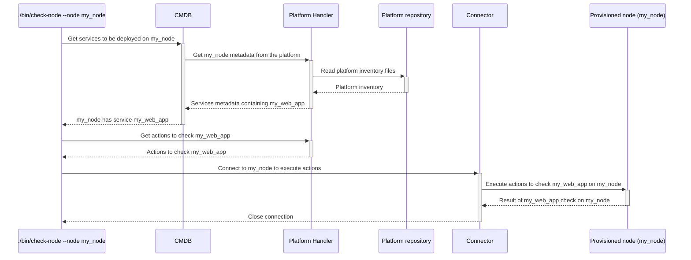

# `check-node`

The `check-node` executable checks the differences of configuration between what is stored in the platform repositories and what is currently configured on a node.
It will:
1. package the configuration,
2. optionally upload the packaged configuration on an artefact repository, or on the node directly (depends on the node's configuration),
3. run a deployment in why-run mode (harmless) on the node,
4. display the result on screen.

## Process

<!-- Mermaid generator - Section start -->

<details>
<summary>See diagram Mermaid code</summary>


</details>
<!-- Mermaid generator - Section end -->

## Usage

```
Usage: ./bin/check-node [options]

Main options:
    -d, --debug                      Activate debug mode
    -h, --help                       Display help and exit
    -n, --node NODE                  Run the command on a specific node.

Nodes handler options:
    -o, --show-nodes                 Display the list of possible nodes and exit

Command runner options:
    -s, --show-commands              Display the commands that would be run instead of running them

Connector ssh options:
    -g, --ssh-gateway-user USER      Name of the gateway user to be used by the gateways. Can also be set from environment variable hpc_ssh_gateway_user. Defaults to ubradm.
    -j, --ssh-no-control-master      If used, don't create SSH control masters for connections.
    -q, --ssh-no-host-key-checking   If used, don't check for SSH host keys.
    -u, --ssh-user USER              Name of user to be used in SSH connections (defaults to hpc_ssh_user or USER environment variables)
    -w, --password                   If used, then expect SSH connections to ask for a password.
    -y GATEWAYS_CONF,                Name of the gateways configuration to be used. Can also be set from environment variable hpc_ssh_gateways_conf.
        --ssh-gateways-conf

Deployer options:
    -e, --secrets SECRETS_LOCATION   Specify a secrets location. Can be specified several times. Location can be:
                                     * Local path to a JSON file
                                     * URL of the form http[s]://<url>:<secret_id> to get a secret JSON file from a Thycotic Secret Server at the given URL.
    -t, --timeout SECS               Timeout in seconds to wait for each chef run. Only used in why-run mode. (defaults to no timeout)
        --retries-on-error NBR       Number of retries in case of non-deterministic errors (defaults to 0)
```

## Examples

```bash
# Test on node23hst-nn1
./bin/check-node --node node23hst-nn1

# Test on node23hst-nn1 using a secrets file
./bin/check-node --node node23hst-nn1 --secrets passwords.json
```

Example of output:
```
=> ./bin/check-node --node node12had01
Actions Executor configuration used:
 * User: a_usernme
 * Dry run: false
 * Max threads used: 16
 * Gateways configuration: madrid
 * Gateway user: ubradm
 * Debug mode: false

===== Packaging current repository ===== Begin... =====
cd ../chef-repo && rm -rf dist Berksfile.lock && ./bin/thor solo:bundle
Resolving cookbook dependencies...
Fetching 'project' from source at site-cookbooks/project
[...]
      create  data_bag/.gitkeep
      create  .gitignore
      create  .branch
      create  .chef_commit
===== Packaging current repository ===== ...End =====

===== Delivering on artefacts repositories ===== Begin... =====
cd ../chef-repo && ./bin/thor solo:deploy -r git@hpc.172.16.110.42:chef-repo/chef-dist.git -y
Warning: no 'deploy' tag found
Change log for branch v20180326T104601:
<empty>
Done
===== Delivering on artefacts repositories ===== ...End =====

===== Checking on 1 hosts ===== Begin... =====
+ [[ v20180326T104601 == '' ]]
+ [[ http://172.16.110.42/chef-repo/chef-dist.git == '' ]]
[...]
Converging 51 resources
Recipe: site_hadoop::default
  * execute[centos::yum-update] action run
    - Would execute yum -y update
Recipe: ssh::server
  * yum_package[openssh-server] action install (up to date)
  * service[ssh] action enable (up to date)
  * service[ssh] action start (up to date)
  * template[/etc/ssh/sshd_config] action create (up to date)
[...]
Chef Client finished, 3/133 resources would have been updated
===== Checking on 1 hosts ===== ...End =====
```

## Used credentials

| Credential | Usage
| --- | --- |
| `thycotic` | Used to connect to the Thycotic secret server if used within the `--secrets` option |

## Used Metadata

| Metadata | Type | Usage
| --- | --- | --- |
| `image` | `String` | OS image corresponding to the node |
| `services` | `Array<String>` | List of services to check for |

## Used environment variables

| Variable | Usage
| --- | --- |
| `hpc_certificates` | Directory containing certificates to be deployed on nodes by default. If ommitted, then no certificate is deployed. |
| `hpc_domain_for_thycotic` | Logon domain used to connect to the Thycotic secret server if used within the `--secrets` option |

## External tools dependencies

None
