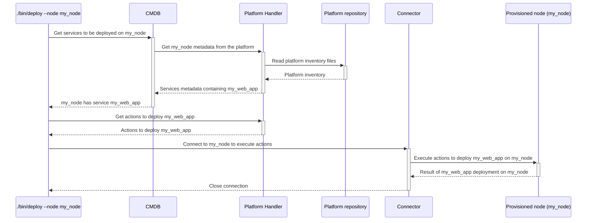

# `deploy`

The `deploy` executable will deploy the `master` branch on a node or list of nodes.
It will:
1. package the configuration,
2. optionally upload the packaged configuration on all needed artefact repositories, or on the nodes directly (depends on the nodes' configuration),
3. run deployments on all specified nodes,
4. display the result on screen, or in local log files (in case of parallel executions).

## Process



## Usage

```
Usage: ./bin/deploy [options]

Main options:
    -d, --debug                      Activate debug mode
    -h, --help                       Display help and exit

Nodes handler options:
    -o, --show-nodes                 Display the list of possible nodes and exit

Nodes selection options:
    -a, --all-nodes                  Select all nodes
    -b, --nodes-platform PLATFORM    Select nodes belonging to a given platform name. Available platforms are: ansible-repo, chef-repo (can be used several times)
    -l, --nodes-list LIST            Select nodes defined in a nodes list (can be used several times)
    -n, --node NODE                  Select a specific node. Can be a regular expression to select several nodes if used with enclosing "/" characters. (can be used several times).
        --nodes-service SERVICE      Select nodes implementing a given service (can be used several times)
        --nodes-git-impact GIT_IMPACT
                                     Select nodes impacted by a git diff from a platform (can be used several times).
                                     GIT_IMPACT has the format PLATFORM:FROM_COMMIT:TO_COMMIT:FLAGS
                                     * PLATFORM: Name of the platform to check git diff from. Available platforms are: ansible-repo, chef-repo
                                     * FROM_COMMIT: Commit ID or refspec from which we perform the diff. If ommitted, defaults to master
                                     * TO_COMMIT: Commit ID ot refspec to which we perform the diff. If ommitted, defaults to the currently checked-out files
                                     * FLAGS: Extra comma-separated flags. The following flags are supported:
                                       - min: If specified then each impacted service will select only 1 node implementing this service. If not specified then all nodes implementing the impacted services will be selected.

Command runner options:
    -s, --show-commands              Display the commands that would be run instead of running them

Actions Executor options:
    -m, --max-threads NBR            Set the number of threads to use for concurrent queries (defaults to 16)

Connector ssh options:
    -g, --ssh-gateway-user USER      Name of the gateway user to be used by the gateways. Can also be set from environment variable hpc_ssh_gateway_user. Defaults to ubradm.
    -j, --ssh-no-control-master      If used, don't create SSH control masters for connections.
    -q, --ssh-no-host-key-checking   If used, don't check for SSH host keys.
    -u, --ssh-user USER              Name of user to be used in SSH connections (defaults to hpc_ssh_user or USER environment variables)
    -w, --password                   If used, then expect SSH connections to ask for a password.
    -y GATEWAYS_CONF,                Name of the gateways configuration to be used. Can also be set from environment variable hpc_ssh_gateways_conf.
        --ssh-gateways-conf

Deployer options:
    -e, --secrets SECRETS_LOCATION   Specify a secrets location. Can be specified several times. Location can be:
                                     * Local path to a JSON file
                                     * URL of the form http[s]://<url>:<secret_id> to get a secret JSON file from a Thycotic Secret Server at the given URL.
    -p, --parallel                   Execute the commands in parallel (put the standard output in files <hybrid-platforms-dir>/run_logs/*.stdout)
    -t, --timeout SECS               Timeout in seconds to wait for each chef run. Only used in why-run mode. (defaults to no timeout)
    -W, --why-run                    Use the why-run mode to see what would be the result of the deploy instead of deploying it for real.
        --retries-on-error NBR       Number of retries in case of non-deterministic errors (defaults to 0)
```

## Examples

```bash
# Deploy master on node23hst-nn1
./bin/deploy --node node23hst-nn1

# Check in "why run" mode the deployment of master on node23hst-nn1 (equivalent to ./bin/check-node --node node23hst-nn1)
./bin/deploy --node node23hst-nn1 --why-run

# Check in "why run" mode the deployment of master on node23hst-nn1 with a timeout of 1 minute
./bin/deploy --node node23hst-nn1 --why-run --timeout 60

# Deploy master using a file containing secrets on node23hst-nn1
./bin/deploy --node node23hst-nn1 --secrets passwords.json

# Deploy master on all nodes containing xae in their name
./bin/deploy --node /xae/

# Deploy master on all nodes containing xae in their name in parallel (and send each standard output in log files in ./run_logs/*.stdout)
./bin/deploy --node /xae/ --parallel

# Deploy master on all nodes containing xae in their name in parallel and using 32 threads in parallel
./bin/deploy --node /xae/ --parallel --max-threads 32

# Deploy master on all nodes defined in the list xaebhsone (from ./hosts_lists/xaebhsone)
./bin/deploy --nodes-list xaebhsone

# Deploy master on all nodes defined in the list xaebhsone and also node12hst-nn1 and node12hst-nn2
./bin/deploy --nodes-list xaebhsone --node node12hst-nn1 --node node12hst-nn2

# Deploy master on all nodes
./bin/deploy --all-nodes
```

Example of output:
```
=> ./bin/deploy --node node12had01 --why-run
Actions Executor configuration used:
 * User: a_usernme
 * Dry run: false
 * Max threads used: 16
 * Gateways configuration: madrid
 * Gateway user: ubradm
 * Debug mode: false

===== Packaging current repository ===== Begin... =====
cd ../chef-repo && rm -rf dist Berksfile.lock && ./bin/thor solo:bundle
Resolving cookbook dependencies...
Fetching 'project' from source at site-cookbooks/project
[...]
      create  data_bag/.gitkeep
      create  .gitignore
      create  .branch
      create  .chef_commit
===== Packaging current repository ===== ...End =====

===== Delivering on artefacts repositories ===== Begin... =====
cd ../chef-repo && ./bin/thor solo:deploy -r git@hpc.172.16.110.42:chef-repo/chef-dist.git -y
Warning: no 'deploy' tag found
Change log for branch v20180326T104601:
<empty>
Done
===== Delivering on artefacts repositories ===== ...End =====

===== Checking on 1 hosts ===== Begin... =====
+ [[ v20180326T104601 == '' ]]
+ [[ http://172.16.110.42/chef-repo/chef-dist.git == '' ]]
[...]
Converging 51 resources
Recipe: site_hadoop::default
  * execute[centos::yum-update] action run
    - Would execute yum -y update
Recipe: ssh::server
  * yum_package[openssh-server] action install (up to date)
  * service[ssh] action enable (up to date)
  * service[ssh] action start (up to date)
  * template[/etc/ssh/sshd_config] action create (up to date)
[...]
Chef Client finished, 3/133 resources would have been updated
===== Checking on 1 hosts ===== ...End =====
```

## Used credentials

| Credential | Usage
| --- | --- |
| `thycotic` | Used to connect to the Thycotic secret server if used within the `--secrets` option |

## Used Metadata

| Metadata | Type | Usage
| --- | --- | --- |
| `image` | `String` | OS image corresponding to the node |
| `services` | `Array<String>` | List of services to deploy |

## Used environment variables

| Variable | Usage
| --- | --- |
| `hpc_certificates` | Directory containing certificates to be deployed on nodes by default. If ommitted, then no certificate is deployed. |
| `hpc_domain_for_thycotic` | Logon domain used to connect to the Thycotic secret server if used within the `--secrets` option |

## External tools dependencies

None
