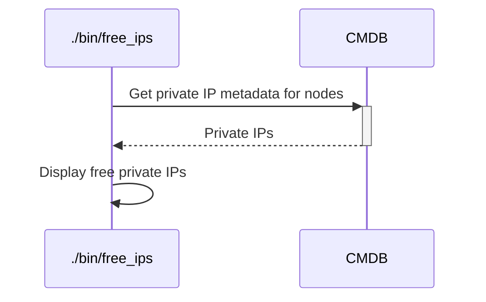

# `free_ips`

The `free_ips` executable will output all free IP ranges for any used range.
Useful to assign new IPs.

***This executable is still in alpha version: not properly tested, no clear process, no stable interface. Pending [this ticket](https://github.com/sweet-delights/hybrid-platforms-conductor/issues/45).***

## Process

<!-- Mermaid generator - Section start -->

<details>
<summary>See diagram Mermaid code</summary>


</details>
<!-- Mermaid generator - Section end -->

## Usage

```
Usage: ./bin/free_ips [options]

Main options:
    -d, --debug                      Activate debug mode
    -h, --help                       Display help and exit

Nodes handler options:
    -o, --show-nodes                 Display the list of possible nodes and exit

Command runner options:
    -s, --show-commands              Display the commands that would be run instead of running them
```

## Examples

```bash
./bin/free_ips
```

Example of output:
```
=> ./bin/free_ips
Free IPs for 172.16.0: [11, 20, 23..29, 31, 34, 37..40, 42..45, 48, 51..58, 60, 63..72, 76, 79..80, 82..83, 87, 90..95, 97..101, 103..104, 107..109, 111..113, 115, 117, 119..120, 123..124, 127, 129, 131, 139, 142..149, 153..169, 171..180, 182..189, 191, 193..209, 211..221, 223..251, 253..255]
Free IPs for 172.16.1: [21..100, 102, 106, 108, 110..112, 114, 116..119, 121..124, 126, 132..177, 179..200, 205..209, 211..221, 223..252, 254..255]
Free IPs for 172.16.2: [102, 110..111, 113, 120..121, 127, 133, 142..150, 194..200, 204..209, 214..221, 223..251, 253..255]
Free IPs for 172.16.3: [11..99, 102, 106..199, 201..255]
Free IPs for 172.16.4: [12..100, 102, 106, 109, 112..255]
Free IPs for 172.16.5: [102, 105..255]
Free IPs for 172.16.6: [41..64, 85..102, 104..109, 116..128, 134..255]
Free IPs for 172.16.7: [28..102, 104..106, 113..255]
Free IPs for 172.16.8: [18..100, 102, 104, 106, 113..119, 121..122, 124..159, 166..170, 196..200, 204..255]
Free IPs for 172.16.9: [86..102, 104..106, 113..122, 125, 128..255]
Free IPs for 172.16.10: [5..104, 106..255]
Free IPs for 172.16.16: [8..19, 23..25, 28, 30, 32..33, 35..36, 39, 41..42, 44..47, 49..51, 54..62, 64..69, 74, 78, 81, 83, 93, 96..98, 104, 110, 114..116, 118, 125..128, 131..136, 138..152, 156..169, 171..177, 179, 181, 183..185, 187, 189, 191, 193..209, 212..255]
Free IPs for 172.16.110: [43..54, 56..57, 60..82, 84..105, 108..118, 120..203, 208..255]
Free IPs for 172.16.111: [22..23, 25..26, 28..30, 32..46, 48..49, 54..255]
Free IPs for 172.16.132: [16..47, 49, 51..181, 183..187, 189..216, 218..225, 227..229, 231..252, 255]
Free IPs for 172.16.133: [18..50, 52, 54..95, 97, 99..120, 122..123, 125..128, 130..134, 136..155, 157..163, 166..252, 254..255]
Free IPs for 172.16.134: [2, 4..54, 56..65, 67..210, 212..222, 224..228, 231..255]
Free IPs for 172.16.135: [61, 63, 65, 67, 72..89, 93, 95..96, 98..104, 107..110, 115..122, 124..126, 131..255]
Free IPs for 172.16.139: [99..255]
Free IPs for 172.30.14: [227..255]
Free IPs for 192.168.0: [3..255]
```

## Used credentials

| Credential | Usage
| --- | --- |

## Used Metadata

| Metadata | Type | Usage
| --- | --- | --- |
| `private_ips` | `Array<String>` | List of private IPs |

## Used environment variables

| Variable | Usage
| --- | --- |

## External tools dependencies

None
