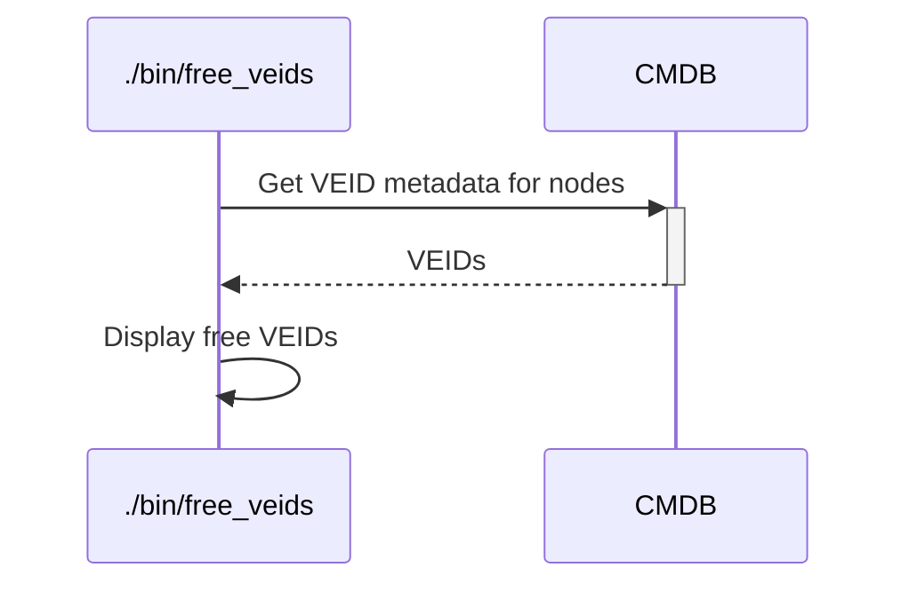

# `free_veids`

The `free_veids` executable will output all free VEIDs (smaller than 10000).
Useful to assign unused VEIDs to new VMs to be created.

***This executable is still in alpha version: not properly tested, no clear process, no stable interface. Pending [this ticket](https://github.com/sweet-delights/hybrid-platforms-conductor/issues/45).***

## Process



## Usage

```
Usage: ./bin/free_veids [options]

Main options:
    -d, --debug                      Activate debug mode
    -h, --help                       Display help and exit

Nodes handler options:
    -o, --show-nodes                 Display the list of possible nodes and exit

Command runner options:
    -s, --show-commands              Display the commands that would be run instead of running them
```

## Examples

```bash
./bin/free_veids
```

Example of output:
```
=> ./bin/free_veids
Free VEIDs: [420, 426, 428, 430, 434, 437..438, 445..446, 449..450, 453, 456..457, 459, 464, 466..467, 471, 475..476, 484, 488, 490, 493, 500..502, 504..513, 523, 525, 536, 544, 546, 554..555, 560..566, 578, 589, 594, 642..659, 668..9999]
```

## Used credentials

| Credential | Usage
| --- | --- |

## Used Metadata

| Metadata | Type | Usage
| --- | --- | --- |

## Used environment variables

| Variable | Usage
| --- | --- |

## External tools dependencies

None
