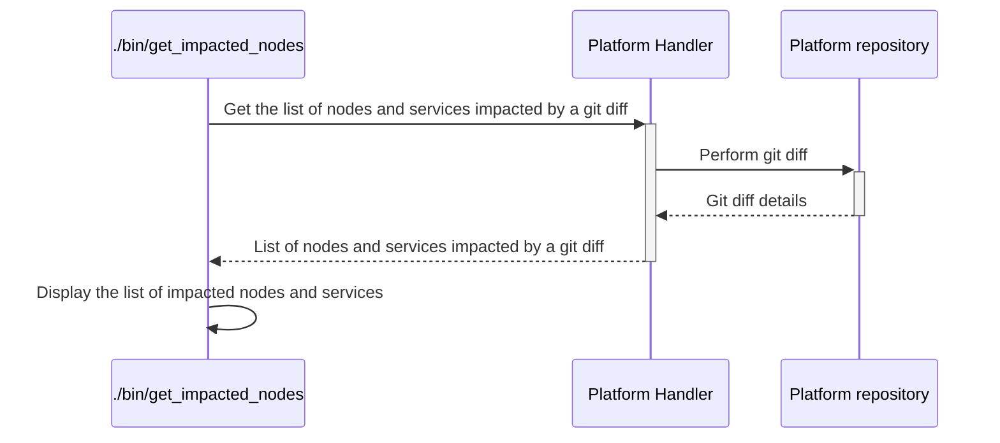

# `get_impacted_nodes`

The `get_impacted_nodes` executable reports nodes impacted by a git diff in one of the platforms.
This is especially useful to know which nodes have to be tested against a given PR or local code difference.

## Process

<!-- Mermaid generator - Section start -->

<details>
<summary>See diagram Mermaid code</summary>


</details>
<!-- Mermaid generator - Section end -->

## Usage

```
Usage: ./bin/get_impacted_nodes [options]

Main options:
    -d, --debug                      Activate debug mode
    -h, --help                       Display help and exit
    -f, --from-commit COMMIT_ID      Specify the GIT commit from which we look for diffs. Defaults to master.
    -p, --platform PLATFORM_NAME     Specify the repository on which to perform the diff. Possible values are chef-repo, ansible-repo
        --smallest-test-sample       Display the minimal set of nodes to check that would validate all modifications.
    -t, --to-commit COMMIT_ID        Specify the GIT commit to which we look for diffs. Defaults to current checked out files.

Nodes handler options:
    -o, --show-nodes                 Display the list of possible nodes and exit

Command runner options:
    -s, --show-commands              Display the commands that would be run instead of running them
```

## Examples

```bash
# Get nodes impacted by current modifications in the chef-repo repository
./bin/get_impacted_nodes --platform chef-repo

# Get nodes impacted by modifications between 2 commit IDs in the chef-repo repository
./bin/get_impacted_nodes --platform chef-repo --from-commit 6e45ff --to-commit aac411

# Get the smallest set of nodes to be tested to validate changes from a branch compared to master
./bin/get_impacted_nodes --platform chef-repo --to-commit my_branch --smallest-test-sample
```

Here is an example of output:
```

* 1 impacted services:
websql

* 2 impacted nodes (directly):
node12hst-nn6
node12hst-nn2

* 3 impacted nodes (total):
node12hst-nn6
node12hst-nn1
node12hst-nn2
```

## Used credentials

| Credential | Usage
| --- | --- |

## Used Metadata

| Metadata | Type | Usage
| --- | --- | --- |

## Used environment variables

| Variable | Usage
| --- | --- |

## External tools dependencies

None
