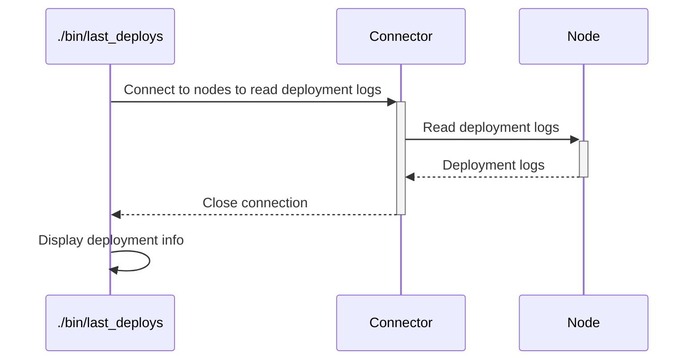

# `last_deploys`

The `last_deploys` executable will fetch the last deployments information for a given list of nodes and display it.

## Process



## Usage

```
Usage: ./bin/last_deploys [options]

Main options:
    -d, --debug                      Activate debug mode
    -h, --help                       Display help and exit
        --sort-by SORT               Specify a sort. Possible values are: commit_comment, date, node, repo_name, user. Each value can append _desc to specify a reverse sorting. Defaults to node.

Nodes handler options:
    -o, --show-nodes                 Display the list of possible nodes and exit

Nodes selection options:
    -a, --all-nodes                  Select all nodes
    -b, --nodes-platform PLATFORM    Select nodes belonging to a given platform name. Available platforms are: ansible-repo, chef-repo (can be used several times)
    -l, --nodes-list LIST            Select nodes defined in a nodes list (can be used several times)
    -n, --node NODE                  Select a specific node. Can be a regular expression to select several nodes if used with enclosing "/" characters. (can be used several times).
    -r, --nodes-service SERVICE      Select nodes implementing a given service (can be used several times)
        --nodes-git-impact GIT_IMPACT
                                     Select nodes impacted by a git diff from a platform (can be used several times).
                                     GIT_IMPACT has the format PLATFORM:FROM_COMMIT:TO_COMMIT:FLAGS
                                     * PLATFORM: Name of the platform to check git diff from. Available platforms are: ansible-repo, chef-repo
                                     * FROM_COMMIT: Commit ID or refspec from which we perform the diff. If ommitted, defaults to master
                                     * TO_COMMIT: Commit ID ot refspec to which we perform the diff. If ommitted, defaults to the currently checked-out files
                                     * FLAGS: Extra comma-separated flags. The following flags are supported:
                                       - min: If specified then each impacted service will select only 1 node implementing this service. If not specified then all nodes implementing the impacted services will be selected.

Command runner options:
    -s, --show-commands              Display the commands that would be run instead of running them

Actions Executor options:
    -m, --max-threads NBR            Set the number of threads to use for concurrent queries (defaults to 64)

Connector ssh options:
    -g, --ssh-gateway-user USER      Name of the gateway user to be used by the gateways. Can also be set from environment variable hpc_ssh_gateway_user. Defaults to ubradm.
    -j, --ssh-no-control-master      If used, don't create SSH control masters for connections.
    -q, --ssh-no-host-key-checking   If used, don't check for SSH host keys.
    -u, --ssh-user USER              Name of user to be used in SSH connections (defaults to hpc_ssh_user or USER environment variables)
    -w, --password                   If used, then expect SSH connections to ask for a password.
    -y GATEWAYS_CONF,                Name of the gateways configuration to be used. Can also be set from environment variable hpc_ssh_gateways_conf.
        --ssh-gateways-conf
```

## Examples

```bash
# Check deployments for all nodes
./bin/last_deploys --all-nodes

# Check deployments for all nodes, sorted by date descending
./bin/last_deploys --all-nodes --sort-by date_desc
```

Example of output:
```
+----------------+---------------------+-----------+---------------+------------------+-------------+----------------------------+-------+
| Hostname       | Date                | Admin     | Git artefact  | Git branch       | Chef commit | Chef comment               | Error |
+----------------+---------------------+-----------+---------------+------------------+-------------+----------------------------+-------+
| node10         | 2017-11-22 09:50:47 | a_usernme | 172.16.0.46   | v20171122T110551 | 73c2017a2a8 | Added sorting capabilities |       |
| node12had43    | 2017-11-22 10:07:37 | a_usernme | 172.16.110.42 | v20171122T110551 | 73c2017a2a8 | Added sorting capabilities |       |
| node12hst-nn6  | 2017-11-22 10:07:35 | a_usernme | 172.16.110.42 | v20171122T110551 | 73c2017a2a8 | Added sorting capabilities |       |
| node12hst-nn9  | 2017-11-23 18:08:59 | root      | 172.16.110.42 | v20171123T190837 | 73c2017a2a8 | Added sorting capabilities |       |
| node12hst-nn2  | 2017-11-22 10:07:37 | a_usernme | 172.16.110.42 | v20171122T110551 | 73c2017a2a8 | Added sorting capabilities |       |
| node12hst-nn3  | 2017-11-22 10:07:37 | a_usernme | 172.16.110.42 | v20171122T110551 | 73c2017a2a8 | Added sorting capabilities |       |
| node12lnx10    | 2017-11-22 11:07:33 | a_usernme | 172.16.110.42 | v20171122T110551 | 73c2017a2a8 | Added sorting capabilities |       |
| xaeprjcttlbd01 | 2017-11-23 18:43:01 | a_usernme | 172.16.0.46   | v20171123T194235 | 73c2017a2a8 | Added sorting capabilities |       |
+----------------+---------------------+-----------+---------------+------------------+-------------+----------------------------+-------+
```

## Used credentials

| Credential | Usage
| --- | --- |

## Used Metadata

| Metadata | Type | Usage
| --- | --- | --- |

## Used environment variables

| Variable | Usage
| --- | --- |

## External tools dependencies

None
