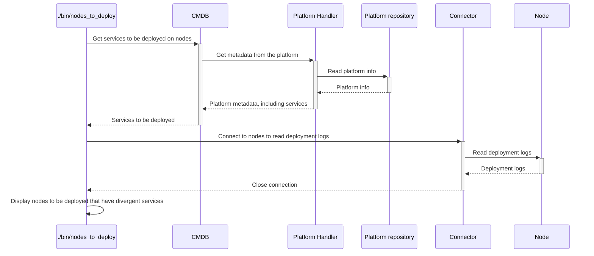

# `nodes_to_deploy`

The `nodes_to_deploy` executable is used to know which nodes need to be deployed, considering:
* the deployment schedule allocated to the nodes,
* the last level of code that has been deployed on the node.
The deployment schedule is defined by the configuration DSL, with the [`deployment_schedule` method](../config_dsl.md).
The list of nodes is given in standard output.

## Process

<!-- Mermaid generator - Section start -->

<details>
<summary><sub><sup>Diagram code</sup></sub></summary>


</details>
<!-- Mermaid generator - Section end -->

## Usage

```
Usage: ./bin/nodes_to_deploy [options]

Main options:
    -d, --debug                      Activate debug mode
    -h, --help                       Display help and exit
        --deployment-time DATETIME   Set the deployment time to be considered while matching the schedules. Defaults to now.
        --ignore-deployed-info       Ignore the current deployed information.
        --ignore-schedule            Ignore the deployment schedules.

Nodes handler options:
    -o, --show-nodes                 Display the list of possible nodes and exit

Nodes selection options:
    -a, --all-nodes                  Select all nodes
    -b, --nodes-platform PLATFORM    Select nodes belonging to a given platform name. Available platforms are: ansible-repo, chef-repo (can be used several times)
    -l, --nodes-list LIST            Select nodes defined in a nodes list (can be used several times)
    -n, --node NODE                  Select a specific node. Can be a regular expression to select several nodes if used with enclosing "/" characters. (can be used several times).
    -r, --nodes-service SERVICE      Select nodes implementing a given service (can be used several times)
        --nodes-git-impact GIT_IMPACT
                                     Select nodes impacted by a git diff from a platform (can be used several times).
                                     GIT_IMPACT has the format PLATFORM:FROM_COMMIT:TO_COMMIT:FLAGS
                                     * PLATFORM: Name of the platform to check git diff from. Available platforms are: ansible-repo, chef-repo
                                     * FROM_COMMIT: Commit ID or refspec from which we perform the diff. If ommitted, defaults to master
                                     * TO_COMMIT: Commit ID ot refspec to which we perform the diff. If ommitted, defaults to the currently checked-out files
                                     * FLAGS: Extra comma-separated flags. The following flags are supported:
                                       - min: If specified then each impacted service will select only 1 node implementing this service. If not specified then all nodes implementing the impacted services will be selected.

Command runner options:
    -s, --show-commands              Display the commands that would be run instead of running them

Actions Executor options:
    -m, --max-threads NBR            Set the number of threads to use for concurrent queries (defaults to 16)

Connector ssh options:
    -g, --ssh-gateway-user USER      Name of the gateway user to be used by the gateways. Can also be set from environment variable hpc_ssh_gateway_user. Defaults to ubradm.
    -j, --ssh-no-control-master      If used, don't create SSH control masters for connections.
    -q, --ssh-no-host-key-checking   If used, don't check for SSH host keys.
    -u, --ssh-user USER              Name of user to be used in SSH connections (defaults to hpc_ssh_user or USER environment variables)
    -w, --password                   If used, then expect SSH connections to ask for a password.
    -y GATEWAYS_CONF,                Name of the gateways configuration to be used. Can also be set from environment variable hpc_ssh_gateways_conf.
        --ssh-gateways-conf
```

## Examples

```bash
# Get nodes to be deployed now
./bin/nodes_to_deploy

# Get nodes to be deployed now among a given set of nodes
./bin/nodes_to_deploy --node /node12.+/

# Get nodes to be deployed now, ignoring their current deployed information
./bin/nodes_to_deploy --ignore-deployed-info

# Get nodes to be deployed only considering their deployed information
./bin/nodes_to_deploy --ignore-schedule

# Get nodes that would be deployed on October 1st 2020 at 10:00:00 UTC
./bin/nodes_to_deploy --deployment-time "2020-10-01 10:00:00"
```

Example of output:
```
===== Nodes to deploy =====
node12had50
node12had51
node12had52
node12had53
node12had54
node12had55
node12had57
node12had58
node12had59
node12hst-nn5
node12hst-nn3
node12lnx18
```

## Used credentials

| Credential | Usage
| --- | --- |

## Used Metadata

| Metadata | Type | Usage
| --- | --- | --- |

## Used environment variables

| Variable | Usage
| --- | --- |

## External tools dependencies

None
