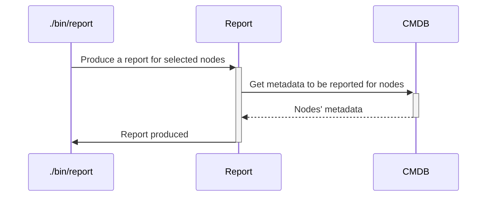

# `report`

The `report` executable will produce some reports for a list of nodes, using a given format and locale.
This executable is using [report plugins](../plugins.md#report) so that the tool is easily extensible to any format or locale needed (think of CSV, Excel, DNS configuration files, other configuration management tools...).

## Process



## Usage

```
Usage: ./bin/report [options]

Main options:
    -d, --debug                      Activate debug mode
    -h, --help                       Display help and exit

Nodes handler options:
    -o, --show-nodes                 Display the list of possible nodes and exit

Nodes selection options:
    -a, --all-nodes                  Select all nodes
    -b, --nodes-platform PLATFORM    Select nodes belonging to a given platform name. Available platforms are: ansible-repo, chef-repo (can be used several times)
    -l, --nodes-list LIST            Select nodes defined in a nodes list (can be used several times)
    -n, --node NODE                  Select a specific node. Can be a regular expression to select several nodes if used with enclosing "/" characters. (can be used several times).
    -r, --nodes-service SERVICE      Select nodes implementing a given service (can be used several times)
        --nodes-git-impact GIT_IMPACT
                                     Select nodes impacted by a git diff from a platform (can be used several times).
                                     GIT_IMPACT has the format PLATFORM:FROM_COMMIT:TO_COMMIT:FLAGS
                                     * PLATFORM: Name of the platform to check git diff from. Available platforms are: ansible-repo, chef-repo
                                     * FROM_COMMIT: Commit ID or refspec from which we perform the diff. If ommitted, defaults to master
                                     * TO_COMMIT: Commit ID ot refspec to which we perform the diff. If ommitted, defaults to the currently checked-out files
                                     * FLAGS: Extra comma-separated flags. The following flags are supported:
                                       - min: If specified then each impacted service will select only 1 node implementing this service. If not specified then all nodes implementing the impacted services will be selected.

Command runner options:
    -s, --show-commands              Display the commands that would be run instead of running them

Reports handler options:
    -c, --locale LOCALE_CODE         Generate the report in the given format. Possible codes are formats specific. [confluence: en], [stdout: en], [mediawiki: en]
    -f, --format FORMAT              Generate the report in the given format. Possible formats are confluence, mediawiki, stdout. Default: stdout.
```

## Examples

```bash
# Output all nodes info using mediawiki format
./bin/report --format mediawiki

# Output all nodes info using mediawiki format in en locale
./bin/report --format mediawiki --locale en

# Output all nodes containing /xae/ in their names using mediawiki format
./bin/report --node /xae/ --format mediawiki
```

Example of output:
```
=> ./bin/report --format mediawiki
Back to the [[Hadoop]] / [[Impala]] / [[XAE_Network_Topology]] portal pages

This page has been generated using <code>./helpers/report --format mediawiki</code> on 2018-03-26 08:58:55 UTC.

= Physical nodes =

== Independent nodes ==

=== 172.16.0/24 ===

* '''WinNode''' - 172.16.0.140 - AD of QlikSense Server (primary AD of Production) - WinNode
: Handled by Chef: No
: Server type: Virtual Machine on node456.my_domain.com.


* '''WinNode''' - 172.16.0.141 - AD of QlikSense Server (secondary AD of Production) - WinNode
: Handled by Chef: No
: Server type: Virtual Machine on node456.my_domain.com.


* '''node237''' - 172.16.0.9 - Gateway to Dedicated Cloud (Former Tableau 8) - node237.my_domain.com
: Handled by Chef: No
: Location: RBX
: OS: Windows Server 2008
: XAE IP: 192.168.255.159
: Public IPs: 
::* 192.168.255.159

[...]

=== 172.16.139/24 ===

* '''node12lnx09''' - 172.16.139.98 - Data Processing (Gurobi, GPU, RStudio)
: OS: Debian 7


=== 172.30.14/24 ===

* '''node''' - 172.30.14.226 - ADP gateway in my_platform IaaS
: OS: RHEL 7 ADP Stadard


=== 192.168.0/24 ===

* '''project-pinger''' - 192.168.0.2 - Product availability tester
: Connection settings: 
::* ip: 192.168.0.77
: Direct deployment: Yes
: Public IPs: 
::* 192.168.0.77


Back to the [[Hadoop]] / [[Impala]] / [[XAE_Network_Topology]] portal pages

[[Category:My Project]]
[[Category:Hadoop]]
[[Category:NoSQL]]
[[Category:Hosting]]
[[Category:XAE]]
[[Category:Server]]
[[Category:Configuration]]
[[Category:Chef]]
```

## Used credentials

| Credential | Usage
| --- | --- |

## Used Metadata

| Metadata | Type | Usage
| --- | --- | --- |

## Used environment variables

| Variable | Usage
| --- | --- |

## External tools dependencies

None
