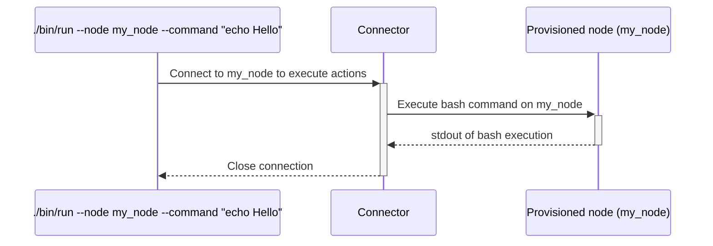

# `run`

The `run` executable will run any Bash command (or interactive session) remotely on a node (or list of nodes).
It will use connectors (SSH...) to do so.

## Process

<!-- Mermaid generator - Section start -->

<details>
<summary><sub><sup>Diagram code</sup></sub></summary>


</details>
<!-- Mermaid generator - Section end -->

## Usage

```
Usage: ./bin/run [options]

Main options:
    -d, --debug                      Activate debug mode
    -h, --help                       Display help and exit
    -c, --command CMD                Command to execute (can't be used with --interactive) (can be used several times, commands will be executed sequentially)
    -f, --commands-file FILE_NAME    Execute commands taken from a file (can't be used with --interactive) (can be used several times, commands will be executed sequentially)
    -i, --interactive                Run an interactive SSH session instead of executing a command (can't be used with --command or --commands-file)
    -p, --parallel                   Execute the commands in parallel (put the standard output in files <hybrid-platforms-dir>/run_logs/*.stdout)
    -t, --timeout SECS               Timeout in seconds to wait for each command (defaults to no timeout)

Nodes handler options:
    -o, --show-nodes                 Display the list of possible nodes and exit

Nodes selection options:
    -a, --all-nodes                  Select all nodes
    -b, --nodes-platform PLATFORM    Select nodes belonging to a given platform name. Available platforms are: ansible-repo, chef-repo (can be used several times)
    -l, --nodes-list LIST            Select nodes defined in a nodes list (can be used several times)
    -n, --node NODE                  Select a specific node. Can be a regular expression to select several nodes if used with enclosing "/" characters. (can be used several times).
    -r, --nodes-service SERVICE      Select nodes implementing a given service (can be used several times)
        --nodes-git-impact GIT_IMPACT
                                     Select nodes impacted by a git diff from a platform (can be used several times).
                                     GIT_IMPACT has the format PLATFORM:FROM_COMMIT:TO_COMMIT:FLAGS
                                     * PLATFORM: Name of the platform to check git diff from. Available platforms are: ansible-repo, chef-repo
                                     * FROM_COMMIT: Commit ID or refspec from which we perform the diff. If ommitted, defaults to master
                                     * TO_COMMIT: Commit ID ot refspec to which we perform the diff. If ommitted, defaults to the currently checked-out files
                                     * FLAGS: Extra comma-separated flags. The following flags are supported:
                                       - min: If specified then each impacted service will select only 1 node implementing this service. If not specified then all nodes implementing the impacted services will be selected.

Command runner options:
    -s, --show-commands              Display the commands that would be run instead of running them

Actions Executor options:
    -m, --max-threads NBR            Set the number of threads to use for concurrent queries (defaults to 16)

Connector ssh options:
    -g, --ssh-gateway-user USER      Name of the gateway user to be used by the gateways. Can also be set from environment variable hpc_ssh_gateway_user. Defaults to ubradm.
    -j, --ssh-no-control-master      If used, don't create SSH control masters for connections.
    -q, --ssh-no-host-key-checking   If used, don't check for SSH host keys.
    -u, --ssh-user USER              Name of user to be used in SSH connections (defaults to hpc_ssh_user or USER environment variables)
    -w, --password                   If used, then expect SSH connections to ask for a password.
    -y GATEWAYS_CONF,                Name of the gateways configuration to be used. Can also be set from environment variable hpc_ssh_gateways_conf.
        --ssh-gateways-conf
```

## Examples

```bash
# Display the possible nodes we can run commands on (also outputs the possible nodes lists, services...)
./bin/run --show-nodes

# Run an interactive SSH session on node23hst-nn1
./bin/run --node node23hst-nn1 --interactive

# Run the hostname command on node23hst-nn1
./bin/run --node node23hst-nn1 --command hostname

# Run the hostname and ls commands on node23hst-nn1
./bin/run --node node23hst-nn1 --command hostname --command ls

# Run a list of commands (taken from the file cmds.list) on node23hst-nn1
./bin/run --node node23hst-nn1 --commands-file cmds.list

# Run a list of commands (taken from the file cmds.list) and the hostname command on node23hst-nn1
./bin/run --node node23hst-nn1 --commands-file cmds.list --command hostname

# Run the hostname command on node23hst-nn1 with a timeout of 5 seconds that would interrupt the command if it does not end before
./bin/run --node node23hst-nn1 --command hostname --timeout 5

# Run the hostname command on all nodes containing xae in parallel (and send each standard output in log files in ./run_logs/*.stdout)
./bin/run --node /xae/ --command hostname --parallel
```

Example of output:
```
=> ./bin/run --node node12had01 --command hostname
node12host.site.my_company.net
```

## Used credentials

| Credential | Usage
| --- | --- |

## Used Metadata

| Metadata | Type | Usage
| --- | --- | --- |

## Used environment variables

| Variable | Usage
| --- | --- |

## External tools dependencies

None
