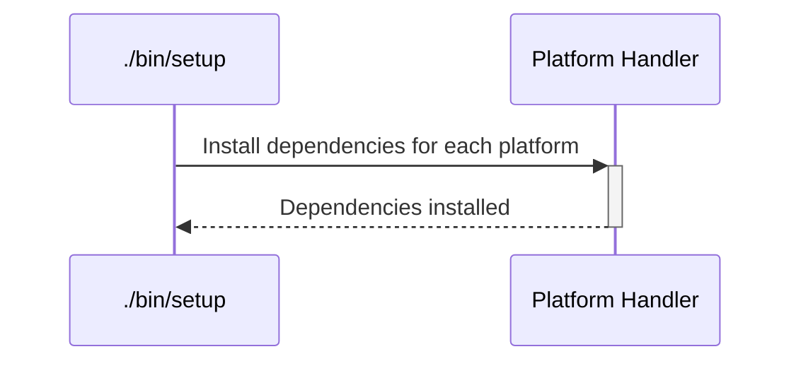

# `setup`

The `setup` executable installs all dependencies needed for a platform to be operated by Hybrid Platforms Conductor.
It is intended to be run only for the initial setup or when such dependencies change (for example if a `Gemfile` of a `chef` platform changes).

***This executable is still in alpha version: not properly tested, no clear process, no stable interface. Pending [this ticket](https://github.com/sweet-delights/hybrid-platforms-conductor/issues/45).***

## Process

<!-- Mermaid generator - Section start -->

<details>
<summary><sub><sup>Diagram code</sup></sub></summary>


</details>
<!-- Mermaid generator - Section end -->

## Usage

```
Usage: ./bin/setup [options]

Main options:
    -d, --debug                      Activate debug mode
    -h, --help                       Display help and exit

Nodes handler options:
    -o, --show-nodes                 Display the list of possible nodes and exit

Command runner options:
    -s, --show-commands              Display the commands that would be run instead of running them
```

## Examples

```bash
# Setup all declared platforms
./bin/setup
```

Here is an example of output:
```
=> ./bin/setup
cd ../chef-repo && rm -rf Gemfile.lock vendor && bundle install --path vendor/bundle --binstubs
Fetching gem metadata from http://rubygems.org/........
Fetching gem metadata from http://rubygems.org/.
Resolving dependencies....
Fetching rake 12.3.1
Installing rake 12.3.1
[...]
Bundle complete! 12 Gemfile dependencies, 101 gems now installed.
Bundled gems are installed into `./vendor/bundle`
Post-install message from minitar:
The `minitar` executable is no longer bundled with `minitar`. If you are
expecting this executable, make sure you also install `minitar-cli`.
cd ./cloned_platforms/xae-chef-repo && rm -rf Gemfile.lock vendor && bundle install --path vendor/bundle --binstubs
Fetching gem metadata from http://rubygems.org/........
Fetching gem metadata from http://rubygems.org/.
Resolving dependencies....
Fetching rake 12.3.1
Installing rake 12.3.1
[...]
Bundle complete! 9 Gemfile dependencies, 98 gems now installed.
Bundled gems are installed into `./vendor/bundle`
```

## Used credentials

| Credential | Usage
| --- | --- |

## Used Metadata

| Metadata | Type | Usage
| --- | --- | --- |

## Used environment variables

| Variable | Usage
| --- | --- |

## External tools dependencies

None
