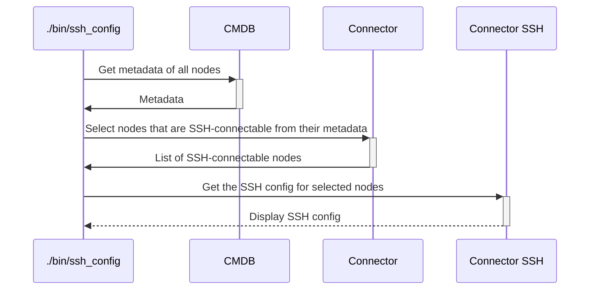

# `ssh_config`

The `ssh_config` executable will output (in standard output) an SSH config file ready to be used to address any node accessible using the [`ssh` connector](../plugins/connector/ssh.md).
The configuration also includes any proxy configuration needed.
The generated file can also be tuned by specifying the gateway user names to be used, and a path to a different ssh executable.

This executable is also used internally by other tools of Hybrid Platforms Conductor to prepare the SSH environment before executing SSH commands, so it's a good way to see and debug the SSH configuration used internally by the Hybrid Platform Conductor's processes.

## Process

<!-- Mermaid generator - Section start -->

<details>
<summary><sub><sup>Diagram code</sup></sub></summary>


</details>
<!-- Mermaid generator - Section end -->

## Usage

```
Usage: ./bin/ssh_config [options]

Main options:
    -d, --debug                      Activate debug mode
    -h, --help                       Display help and exit
    -x, --ssh-exec FILE_PATH         Path to the SSH executable to be used. Useful to give default options (especially with GIT_SSH). Defaults to ssh.

Nodes handler options:
    -o, --show-nodes                 Display the list of possible nodes and exit

Command runner options:
    -s, --show-commands              Display the commands that would be run instead of running them

Connector ssh options:
    -g, --ssh-gateway-user USER      Name of the gateway user to be used by the gateways. Can also be set from environment variable hpc_ssh_gateway_user. Defaults to ubradm.
    -j, --ssh-no-control-master      If used, don't create SSH control masters for connections.
    -q, --ssh-no-host-key-checking   If used, don't check for SSH host keys.
    -u, --ssh-user USER              Name of user to be used in SSH connections (defaults to hpc_ssh_user or USER environment variables)
    -w, --password                   If used, then expect SSH connections to ask for a password.
    -y GATEWAYS_CONF,                Name of the gateways configuration to be used. Can also be set from environment variable hpc_ssh_gateways_conf.
        --ssh-gateways-conf
```

## Examples

```bash
# Dump in stdout
./bin/ssh_config

# Use it to overwrite directly the SSH config file
./bin/ssh_config >~/.ssh/config ; chmod 600 ~/.ssh/config

# Use it to generate a separate included config file (for OpenSSH version >= 7.3p1)
# Need to add "Include platforms_config" in the existing ~/.ssh/config file.
./bin/ssh_config >~/.ssh/platforms_config

# Dump in stdout, using hadcli as gateway user
./bin/ssh_config --ssh-gateway-user hadcli

# Dump in stdout, using /my/other/ssh instead of ssh
./bin/ssh_config --ssh-exec /my/other/ssh

# Dump in stdout, using the madrid SSH gateways configuration
./bin/ssh_config --ssh-gateways-conf madrid
```

Example of output:
```
=> ./bin/ssh_config

############
# GATEWAYS #
############

# Gateway Nice (when connecting from other sites)
Host my.gateway.com
  User sitegw
  Hostname node12hst-nn5.site.my_company.net

# DMZ Gateway
Host gw.dmz.be
  HostName dmz.my_domain.com
  ProxyCommand ssh -q -W %h:%p my.gateway.com

# Data Gateway
Host gw.data.be
  HostName fr-had.my_domain.com
  ProxyCommand ssh -q -W %h:%p datagw@gw.dmz.be


#############
# ENDPOINTS #
#############

Host *
  User a_usernme
  # Default control socket path to be used when multiplexing SSH connections
  ControlPath /tmp/actions_executor_mux_%h_%p_%r
  PubkeyAcceptedKeyTypes +ssh-dss

# AD_Win2012_NP0 - 172.16.16.105 - ./cloned_platforms/xae-chef-repo - AD of QlikSense Server (primary AD of Non-production) - AD_Win2012_NP0
Host hpc.172.16.16.105 hpc.16.105 hpc.AD_Win2012_NP0
  Hostname 172.16.16.105
  ProxyCommand ssh -q -W %h:%p ubradm@gw.dmz.be

[...]

# xaetitanuwsd01 - 172.16.16.89 - ./cloned_platforms/xae-chef-repo - Traffic Analytics WS (UAT/jessie)
Host hpc.172.16.16.89 hpc.16.89 hpc.xaetitanuwsd01
  Hostname 172.16.16.89
  ProxyCommand ssh -q -W %h:%p ubradm@gw.dmz.be

# project-pinger - 192.168.0.2 - ../chef-repo - Product availability tester
Host hpc.192.168.0.2 hpc.project-pinger
  Hostname 192.168.0.77

```

## Used credentials

| Credential | Usage
| --- | --- |

## Used Metadata

| Metadata | Type | Usage
| --- | --- | --- |

## Used environment variables

| Variable | Usage
| --- | --- |

## External tools dependencies

None
