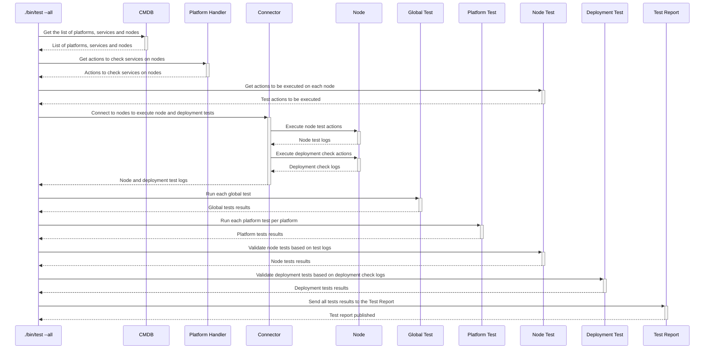

# `test`

The `test` executable runs various tests and displays the eventual errors that have occurred.
Errors are being displayed at the end of the execution, along with a summary of the failed tests and nodes.

This `test` executable is using [test plugins](../plugins/test) to be able to validate various tests (at global level, on each node, or on the check-node output), and uses [test report plugins](../plugins/test_report) to publish test reports on various mediums.

This executable is perfectly suited to be integrated in a continuous integration workflow.

## Process



## Usage

```
Usage: ./bin/test [options]

Main options:
    -d, --debug                      Activate debug mode
    -h, --help                       Display help and exit

Nodes handler options:
    -o, --show-nodes                 Display the list of possible nodes and exit

Nodes selection options:
    -a, --all-nodes                  Select all nodes
    -b, --nodes-platform PLATFORM    Select nodes belonging to a given platform name. Available platforms are: ansible-repo, chef-repo (can be used several times)
    -l, --nodes-list LIST            Select nodes defined in a nodes list (can be used several times)
    -n, --node NODE                  Select a specific node. Can be a regular expression to select several nodes if used with enclosing "/" characters. (can be used several times).
        --nodes-service SERVICE      Select nodes implementing a given service (can be used several times)
        --nodes-git-impact GIT_IMPACT
                                     Select nodes impacted by a git diff from a platform (can be used several times).
                                     GIT_IMPACT has the format PLATFORM:FROM_COMMIT:TO_COMMIT:FLAGS
                                     * PLATFORM: Name of the platform to check git diff from. Available platforms are: ansible-repo, chef-repo
                                     * FROM_COMMIT: Commit ID or refspec from which we perform the diff. If ommitted, defaults to master
                                     * TO_COMMIT: Commit ID ot refspec to which we perform the diff. If ommitted, defaults to the currently checked-out files
                                     * FLAGS: Extra comma-separated flags. The following flags are supported:
                                       - min: If specified then each impacted service will select only 1 node implementing this service. If not specified then all nodes implementing the impacted services will be selected.

Command runner options:
    -s, --show-commands              Display the commands that would be run instead of running them

Connector ssh options:
    -g, --ssh-gateway-user USER      Name of the gateway user to be used by the gateways. Can also be set from environment variable hpc_ssh_gateway_user. Defaults to ubradm.
    -j, --ssh-no-control-master      If used, don't create SSH control masters for connections.
    -q, --ssh-no-host-key-checking   If used, don't check for SSH host keys.
    -u, --ssh-user USER              Name of user to be used in SSH connections (defaults to hpc_ssh_user or USER environment variables)
    -w, --password                   If used, then expect SSH connections to ask for a password.
    -y GATEWAYS_CONF,                Name of the gateways configuration to be used. Can also be set from environment variable hpc_ssh_gateways_conf.
        --ssh-gateways-conf

Deployer options:
    -e, --secrets SECRETS_LOCATION   Specify a secrets location. Can be specified several times. Location can be:
                                     * Local path to a JSON file
                                     * URL of the form http[s]://<url>:<secret_id> to get a secret JSON file from a Thycotic Secret Server at the given URL.
        --retries-on-error NBR       Number of retries in case of non-deterministic errors (defaults to 0)

Tests runner options:
    -i, --tests-list FILE_NAME       Specify a tests file name. The file should contain a list of tests name (1 per line). Can be used several times.
    -k, --skip-run                   Skip running the check-node commands for real, and just analyze existing run logs.
    -r, --report REPORT              Specify a report name. Can be used several times. Can be all for all reports. Possible values: confluence, stdout (defaults to stdout).
    -t, --test TEST                  Specify a test name. Can be used several times. Can be all for all tests. Possible values: ansible_repo_molecule_cdh_admins, ansible_repo_molecule_cdh_datanodes, ansible_repo_molecule_cdh_db, ansible_repo_molecule_cdh_gateways, ansible_repo_molecule_cdh_services, ansible_repo_molecule_common, ansible_repo_molecule_data_gateway, ansible_repo_molecule_dev_servers, ansible_repo_molecule_ds_servers, ansible_repo_molecule_dsnodes, ansible_repo_molecule_import_gateway, ansible_repo_molecule_notebooks, ansible_repo_molecule_tnz_data_gateway, bitbucket_conf, can_be_checked, check_from_scratch, chef_executables, chef_success, chef_woulds, connection, deploy_freshness, deploy_from_scratch, deploy_removes_root_access, executables, food_critic, group_ids, hostname, idempotence, ip, jenkins_ci_conf, jenkins_ci_masters_ok, linear_strategy, obsolete_home_dirs, obsolete_users, orphan_files, private_ips, public_ips, rubocop, spectre, unused_files, unused_node_attributes, unused_recipes, unused_templates, unused_roles, unused_users, user_ids, users_without_roles, veids (defaults to all).
        --max-threads-connections NBR_THREADS
                                     Specify the max number of threads to parallelize tests connecting on nodes (defaults to 64).
        --max-threads-nodes NBR_THREADS
                                     Specify the max number of threads to parallelize tests at node level (defaults to 8).
        --max-threads-platforms NBR_THREADS
                                     Specify the max number of threads to parallelize tests at platform level (defaults to 8).
```

## Examples

```bash
# Execute all tests on all nodes
./bin/test --all-nodes

# Execute only the tests named hostname and ip on all nodes whose names contain xae
./bin/test --test hostname --test ip --node /xae/

# Execute all tests on all nodes, but reuse the content of run_logs instead of why-run deployments
./bin/test --all-nodes --skip-run

# Execute the check_from_scratch test on all nodes impacted by changes made on the branch my_branch
./bin/test --test check_from_scratch --nodes-git-impact chef-repo::my_branch
```

Here is an example of output:
```
========== Error report of 6 tests run on 694 nodes

======= By test:

===== configuration_test found 2 nodes having errors:
  * [ nodehst-nn3 ] - 3 errors:
    - Failed to execute command "hostname -I"
    - Failed to execute command "hostname -s"
    - Failed to execute command "echo 'Test connection - ok'"
  * [ project-pinger ] - 1 errors:
    - Private IP outside


======= By node:

===== [ node45 ] - 1 failing tests:
  * Test configuration_test - 3 errors:
    - Failed to execute command "hostname -I"
    - Failed to execute command "hostname -s"
    - Failed to execute command "echo 'Test connection - ok'"

===== [ node12had41 ] - 1 failing tests:
  * Test configuration_test - 1 errors:
    - Failed to connect

===== [ node237 ] - 1 failing tests:
  * Test configuration_test - 1 errors:
    - Not handled by Chef

===== [ project-pinger ] - 1 failing tests:
  * Test configuration_test - 1 errors:
    - Private IP outside


========== Stats by hosts list:

+--------------------+----------+-----------+
| List name          | % tested | % success |
+--------------------+----------+-----------+
| hosts_with_secrets | 100 %    | 71 %      |
| node12had          | 100 %    | 1 %       |
| xaebhs5had         | 100 %    | 90 %      |
| xaebhsone          | 100 %    | 0 %       |
| xaerbx5had         | 100 %    | 0 %       |
| xaerbxcas          | 100 %    | 0 %       |
| xaerbxhad          | 100 %    | 0 %       |
| xaesbg1cas         | 100 %    | 66 %      |
| xaesbg1had         | 100 %    | 0 %       |
| xaesbg2had         | 100 %    | 0 %       |
| xaesbghad          | 100 %    | 0 %       |
| xaesbgkfk          | 100 %    | 100 %     |
| xaesbgzk           | 100 %    | 100 %     |
| xaetirb1pdnc       | 100 %    | 0 %       |
| xaetirb6tdnc       | 100 %    | 0 %       |
| xaetisb3sdnc       | 100 %    | 0 %       |
| No list            | 100 %    | 18 %      |
+--------------------+----------+-----------+

===== Some errors were found. Check output. =====
```
